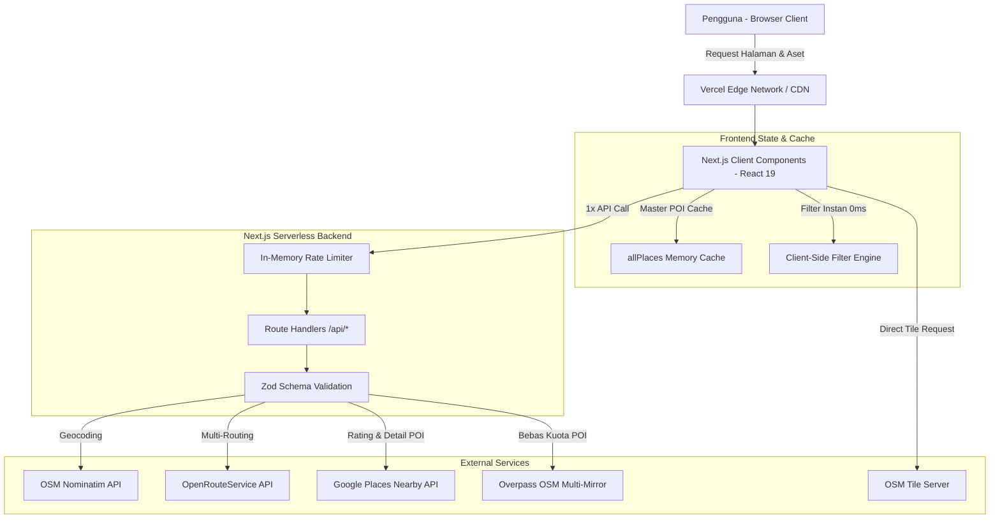
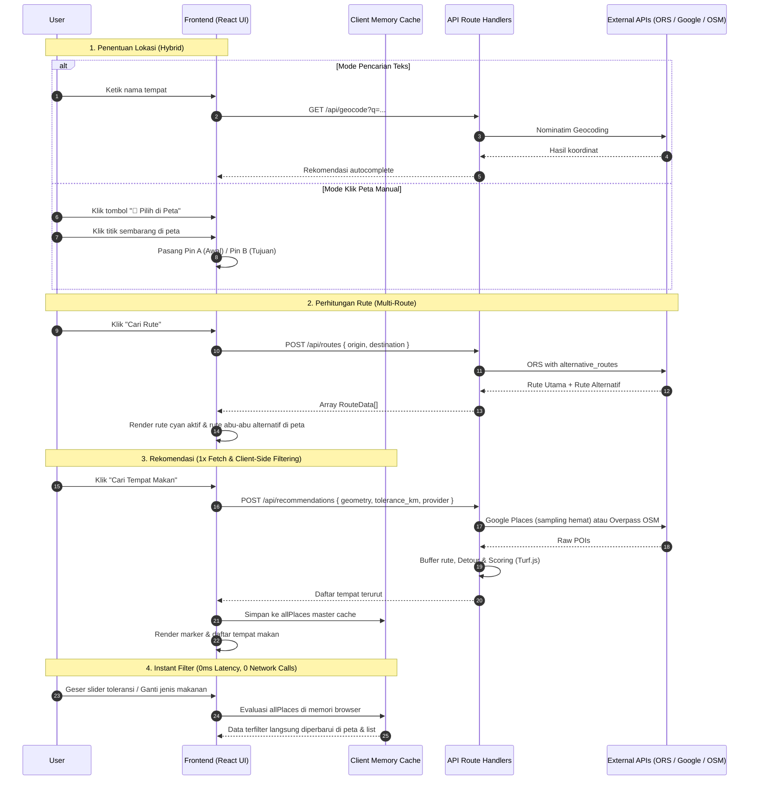

# Architecture.md — Searah (Aplikasi Rekomendasi Tempat Makan Berbasis Rute Perjalanan)

**Versi:** 1.1 (Production Ready)  
**Dokumen Terkait:** [PRD.md](file:///c:/Users/USER/Documents/Self%20Project/searah/PRD.md), [ADR.md](file:///c:/Users/USER/Documents/Self%20Project/searah/ADR.md), [CONVENTIONS.md](file:///c:/Users/USER/Documents/Self%20Project/searah/CONVENTIONS.md)

---

## 1. Infrastructure Architecture

Searah dibangun sebagai **satu aplikasi Next.js monolitik (Full-Stack Monolith)** yang di-deploy ke Vercel. Frontend (React 19 + Leaflet) dan backend (Next.js App Router Route Handlers) berjalan dalam satu deployment yang sama, di mana route handlers dieksekusi sebagai Vercel Serverless Functions.

Tidak ada database relational yang dikelola sendiri pada tahap ini. Data geospasial, rute, dan POI diambil secara dinamis dari penyedia eksternal dan dilindungi oleh lapisan **In-Memory Rate Limiter**, validasi skema runtime Zod, serta arsitektur **Client-Side Caching**.



**Prinsip Arsitektural:**
- Semua panggilan ke API eksternal (Nominatim, OpenRouteService, Google Places, Overpass) dilakukan **dari server (Route Handlers)** untuk menyembunyikan API key, menghindari CORS browser, dan memberlakukan rate limit terpusat.
- Tile peta OpenStreetMap dikonsumsi langsung oleh Leaflet di browser pengguna.

---

## 2. Folder Structure

```
searah/
├── app/
│   ├── layout.tsx                      # Root layout, Google fonts & SEO metadata
│   ├── page.tsx                        # Halaman utama: form, kontrol, list & peta
│   ├── globals.css                     # Tailwind CSS & custom styling
│   └── api/
│       ├── geocode/route.ts            # Proxy geocoding Nominatim + rate limit
│       ├── routes/route.ts             # Proxy routing ORS (multi-rute) + rate limit
│       └── recommendations/route.ts    # Orkestrasi Google Places & Overpass + rate limit
├── components/
│   ├── MapView.tsx                     # Wrapper Leaflet (multi-rute, pin A/B, food marker, anti-XSS)
│   ├── LocationSearchInput.tsx         # Input autocomplete geocoding + tombol "Pilih di Peta"
│   ├── ToleranceSlider.tsx             # Kontrol slider toleransi jarak (km)
│   ├── RecommendationList.tsx          # Daftar rekomendasi tempat terurut
│   └── PlaceDetailCard.tsx             # Kartu detail tempat + direct link navigasi Google Maps
├── lib/
│   ├── rate-limit.ts                   # Sliding window in-memory rate limiter per-IP
│   ├── google-places.ts                # Client Google Places (sampling rute & kuota hemat)
│   ├── overpass.ts                     # Query builder & client Overpass OSM multi-mirror
│   ├── routing.ts                      # Client wrapper OpenRouteService (alternative_routes)
│   ├── geocoding.ts                    # Client wrapper OSM Nominatim
│   ├── geo-utils.ts                    # Turf.js: buffer koridor, detour, scoring & ranking
│   ├── validation.ts                   # Skema Zod untuk seluruh input endpoint
│   └── types.ts                        # Shared TypeScript types & interfaces
├── hooks/
│   ├── useRoute.ts                     # Hook rute aktif & pemilihan rute alternatif
│   └── useRecommendations.ts          # Hook 1x fetch & instant client-side filtering
├── public/                             # Static assets
├── next.config.ts                      # Security Headers (CSP, HSTS, X-Frame-Options, dll)
├── package.json
├── tsconfig.json
├── PRD.md                              # Product Requirements Document
├── ARCHITECTURE.md                     # Arsitektur sistem (dokumen ini)
├── ADR.md                              # Architecture Decision Records
└── CONVENTIONS.md                      # Konvensi pengembangan & batasan scope
```

---

## 3. Frontend & Backend Separation

| Layer | Lokasi | Tanggung Jawab |
|---|---|---|
| **Presentation (UI)** | `components/`, `app/page.tsx` | Render visualisasi peta, input form autocomplete, kartu rute alternatif, panel detail tempat, dan penanganan event klik peta manual. |
| **Client Cache & Filter** | `hooks/useRecommendations.ts` | Menyimpan master data POI (`allPlaces`) hasil fetch tunggal, lalu mengeksekusi filter toleransi jarak dan jenis tempat secara lokal tanpa memanggil jaringan. |
| **API & Security Gateway** | `app/api/*/route.ts`, `lib/rate-limit.ts` | Pemeriksaan kuota rate limit per client IP, sanitasi input dengan Zod, dan penyembunyian error internal (*error sanitization*). |
| **Integration Clients** | `lib/google-places.ts`, `lib/overpass.ts`, `lib/routing.ts`, `lib/geocoding.ts` | Orkestrasi panggilan HTTP ke penyedia eksternal dengan batas waktu (*timeout*), sampling adaptif, dan mekanisme failover otomatis. |
| **Geospatial Engine** | `lib/geo-utils.ts` | Komputasi Turf.js: pembuatan polygon buffer koridor rute, penghitungan jarak tegak lurus, estimasi detour bolak-balik, dan algoritma scoring. |

---

## 4. End-to-End Data Flow



---

## 5. API Architecture & Rate Limiting

Setiap endpoint API publik dilindungi oleh **In-Memory Rate Limiter**:

| Endpoint | Method | Rate Limit (per IP) | Request Body / Query | Deskripsi & Proteksi |
|---|---|---|---|---|
| `/api/geocode` | GET | **45 req / 60 detik** | `?q={query}` (min 2, max 100 char) | Proxy Nominatim. Mematuhi fair-use policy ±1 req/detik OSM. |
| `/api/routes` | POST | **30 req / 60 detik** | `{ origin: {lat, lng}, destination: {lat, lng} }` | Proxy OpenRouteService dengan `alternative_routes` target_count 2. |
| `/api/recommendations` | POST | **20 req / 60 detik** | `{ geometry, tolerance_km, place_type, provider }` | Orkestrasi dual-provider (Google Places / Overpass) + Turf.js scoring. |

**Standard Format Response:**
- Sukses: JSON dengan data payload terstruktur (`{ places: [...], count, provider }` atau `{ routes: [...] }`).
- Error: Status HTTP relevan (400, 429, 502, 504) dengan format:
  ```json
  {
    "error": {
      "code": "RATE_LIMIT_EXCEEDED" | "INVALID_INPUT" | "UPSTREAM_TIMEOUT",
      "message": "Pesan ramah pengguna yang aman"
    }
  }
  ```

---

## 6. Security Architecture (Production Hardened)

1. **Anti-XSS Protection:**
   Data nama tempat makan dari OpenStreetMap bersumber dari publik. Di [MapView.tsx](file:///c:/Users/USER/Documents/Self%20Project/searah/components/MapView.tsx), seluruh teks disanitasi menggunakan fungsi `escapeHtml()` sebelum dimasukkan ke dalam Leaflet `bindPopup()`.
2. **HTTP Security Headers:**
   Dikonfigurasi di [next.config.ts](file:///c:/Users/USER/Documents/Self%20Project/searah/next.config.ts):
   - `Content-Security-Policy`: Membatasi sumber skrip, font Google, tile OpenStreetMap, dan koneksi API.
   - `X-Frame-Options: DENY`: Melindungi aplikasi dari serangan *clickjacking*.
   - `X-Content-Type-Options: nosniff`: Mencegah *MIME-type sniffing*.
   - `Strict-Transport-Security`: Memaksa koneksi HTTPS aman (`max-age=63072000`).
   - `Referrer-Policy: strict-origin-when-cross-origin`.
3. **Secret Isolation:**
   Seluruh API key (`OPENROUTESERVICE_API_KEY`, `GOOGLE_MAPS_API_KEY`) hanya dibaca di backend via `process.env` tanpa prefix `NEXT_PUBLIC_`, menjamin kunci tidak pernah terekspos ke browser pengguna.
4. **Upstream Error Sanitization:**
   Detail internal seperti error stack trace atau parameter koneksi dari upstream API ditangkap di server (`console.error`) dan diganti dengan pesan generik yang aman sebelum dikirim ke response JSON.

---

## 7. Performance & Cost Optimization

1. **Client-Side Filtering (1x Usage):**
   Pencarian POI ke server dilakukan satu kali dengan koridor yang memadai. Slider toleransi jarak dan filter kategori tempat makan dievaluasi secara sinkron di memori browser. Ini menghemat kuota Google Places / Overpass hingga 100% saat pengguna bereksplorasi.
2. **Sampling Rute Cerdas untuk Google Places:**
   Tidak memanggil Google Places di setiap koordinat rute (yang bisa mencapai ribuan titik), melainkan menggunakan algoritma sampling adaptif (hanya 2–5 titik strategis berdasarkan panjang rute).
3. **Multi-Mirror Overpass Failover:**
   Menyiapkan 3 endpoint mirror Overpass API (`overpass-api.de`, `overpass.kumi.systems`, `maps.mail.ru`) dengan timeout 25 detik untuk menjamin ketersediaan data jika satu server publik OSM mengalami lonjakan beban.