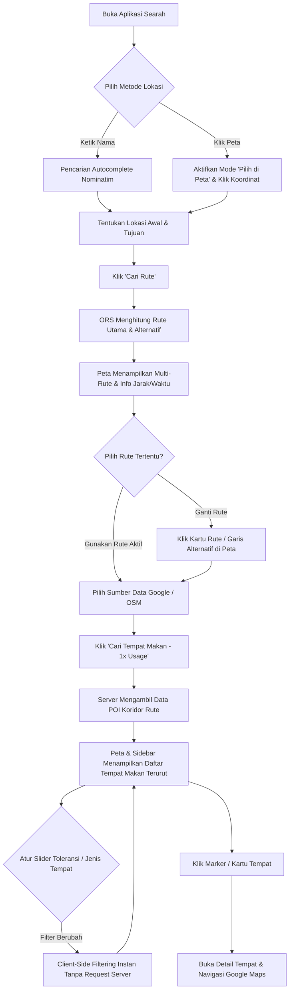

# PRD v1.1 — Searah

## 1. Product Overview

Searah adalah aplikasi berbasis peta yang membantu pengguna menemukan tempat makan (restoran, kafe, fast food, dan sejenisnya) di sepanjang rute perjalanan dari satu lokasi ke lokasi tujuan. Berbeda dari aplikasi pencarian tempat makan konvensional yang mencari berdasarkan radius posisi pengguna saat ini (geofencing statis), Searah menjadikan **koridor rute perjalanan dinamis** sebagai dasar utama pencarian, kalkulasi jarak penyimpangan (*detour*), dan pemeringkatan rekomendasi.

Pengguna dapat menentukan lokasi awal dan tujuan baik melalui pencarian teks autocomplete maupun **pemilihan titik manual langsung di peta (interactive map click)**. Sistem kemudian menghitung rute perjalanan—termasuk menyediakan **opsi rute alternatif**—lalu menyajikan rekomendasi tempat makan di koridor rute tersebut menggunakan data **Google Places** (rating tinggi & ulasan) atau **OpenStreetMap Overpass** (open-source & bebas kuota).

Seluruh sistem dioptimalkan dengan mekanisme **1x API Usage & Client-Side Filtering**, di mana penyesuaian slider toleransi jarak dan filter kategori makanan diproses secara instan di memori browser tanpa melakukan panggilan API berulang kali, serta dilindungi oleh arsitektur keamanan tingkat produksi (*production-ready security hardening*).

---

## 2. Problem / Goal

### Masalah
Saat bepergian (road trip, touring, atau perjalanan harian), pengguna biasanya harus membuka dua aplikasi terpisah: aplikasi navigasi untuk rute jalan, dan aplikasi pencarian tempat makan untuk mencari resto terdekat. Pengguna harus menebak-nebak apakah tempat makan tersebut masih searah atau justru menyebabkan *detour* (penyimpangan rute) yang jauh membuang waktu. Selain itu, ketergantungan hanya pada pencarian teks sering kali gagal jika nama tempat/gang lokal tidak terdaftar di database geocoding.

### Tujuan
1. Menjawab secara presisi: *"Saya bepergian dari A ke B, tempat makan apa saja yang bisa saya singgahi tanpa terlalu jauh keluar dari rute perjalanan saya?"*
2. Memberikan fleksibilitas penentuan lokasi melalui pencarian nama tempat maupun klik langsung di peta (*point-and-click*).
3. Memberikan alternatif rute perjalanan (misal: rute jalan tol vs rute non-tol / alternatif jalan arteri).
4. Mengoptimalkan konsumsi kuota API pihak ketiga melalui arsitektur *client-side instant filtering*.
5. Menjamin keamanan aplikasi web berstandar produksi (perlindungan XSS, security headers, rate limiting anti-bot DoS).

---

## 3. Target User

1. **Pengguna Road Trip & Antar Kota:** Pengemudi mobil atau motor yang membutuhkan tempat makan/istirahat yang efisien dan benar-benar berada di koridor jalur perjalanan.
2. **Pengguna Harian (Commuter):** Pekerja atau mahasiswa yang ingin mampir makan/ngopi saat perjalanan berangkat atau pulang kerja tanpa menambah waktu tempuh secara signifikan.
3. **Wisatawan & Penjelajah Kuliner:** Pengguna yang bepergian ke wilayah baru dan ingin menemukan tempat makan berating tinggi di sepanjang jalurnya.

Aplikasi ditujukan untuk pengguna individu (tanpa login/registrasi pada fase ini), dapat diakses responsif melalui browser desktop maupun mobile.

---

## 4. Core Features

1. **Fleksibilitas Penentuan Lokasi Awal & Tujuan:**
   - **Pencarian Teks Autocomplete:** Didukung oleh OSM Nominatim geocoding.
   - **Pemilihan Manual di Peta (📍 Pilih di Peta):** Pengguna dapat mengklik langsung sembarang titik/jalan di peta untuk menaruh **Pin A (Awal)** dan **Pin B (Tujuan)**.
2. **Kalkulasi Rute Multi-Opsi (Rute Tol & Rute Non-Tol):**
   - Menggunakan OpenRouteService (ORS) dengan eksekusi paralel: Rute Tol / Tercepat dan Rute Non-Tol (Jalur Arteri / Bebas Tol).
   - Menghasilkan rute utama (tercepat) dan minimal 1 rute non-tol yang melintasi jalan arteri kota.
   - Visualisasi rute interaktif di peta (rute aktif berwarna Cyan berpijar, rute alternatif bergaris putus-putus abu-abu yang dapat diklik langsung).
3. **Dual Provider Rekomendasi POI:**
   - **Google Places API:** Menyediakan data rating bintang, jumlah ulasan pengguna, dan estimasi status buka.
   - **OpenStreetMap (Overpass API):** Penyedia open-source gratis tanpa batas kuota dengan mekanisme multi-mirror fallback.
4. **Optimasi 1x API Usage & Instant Client-Side Filtering:**
   - Pencarian POI ke server hanya dilakukan **1 kali per rute**.
   - Perubahan slider toleransi penyimpangan (0.5 km – 10 km) dan filter kategori (Semua, Restoran, Kafe, Fast Food) dievaluasi secara instan di memori browser (0 ms latency, 0 request server tambahan).
   - Disediakan tombol eksplisit *Refresh Server* jika pengguna ingin memperbarui data mentah.
5. **Kalkulasi Spasial & Pemeringkatan (Ranking Algorithm):**
   - Menghitung jarak tegak lurus ke rute (*distance to route*) dan estimasi jarak detour bolak-balik menggunakan Turf.js.
   - Perhitungan skor gabungan (jarak + detour) dengan bonus apresiasi rating Google.
6. **Detail Tempat & Tautan Navigasi Eksternal:**
   - Kartu detail interaktif menampilkan jarak ke rute, estimasi detour, alamat, status buka, serta tombol direct link ke Google Maps Navigation.
7. **Pengerasan Keamanan Tingkat Produksi:**
   - Sanitasi HTML (Anti-XSS) pada Leaflet popup.
   - HTTP Security Headers standar industri (CSP, HSTS, X-Frame-Options, X-Content-Type-Options, Referrer-Policy).
   - In-memory rate limiting per-IP pada seluruh endpoint API (`/api/geocode`, `/api/routes`, `/api/recommendations`).
   - Sanitasi pesan error upstream (mencegah *information disclosure*).

---

## 5. User Flow

---

## 6. Functional Requirements

| ID | Kategori | Kebutuhan Fungsional |
|---|---|---|
| **FR1** | Geocoding | Sistem dapat menerima input teks nama lokasi awal & tujuan dan mengonversinya menjadi koordinat melalui Nominatim. |
| **FR2** | Geocoding Manual | Sistem menyediakan tombol "Pilih di Peta" yang memungkinkan pengguna memilih koordinat awal (Pin A) dan tujuan (Pin B) dengan mengklik sembarang titik pada peta. |
| **FR3** | Routing | Sistem menghitung rute perjalanan antara dua koordinat menggunakan OpenRouteService. |
| **FR4** | Multi-Routing | Sistem meminta dan menampilkan rute alternatif dari ORS (`alternative_routes`), serta memungkinkan pengguna berpindah rute aktif melalui UI atau klik garis peta. |
| **FR5** | Buffer Koridor | Sistem membuat polygon buffer di sekitar geometri rute sesuai nilai toleransi jarak (km) menggunakan Turf.js. |
| **FR6** | Dual Data Source | Sistem mendukung pengambilan data POI dari Google Places API (Nearby Search) dan OpenStreetMap (Overpass API) dengan fallback otomatis. |
| **FR7** | 1x API Fetch | Panggilan API rekomendasi ke server dilakukan maksimal 1 kali per rute, menyimpan master data di frontend. |
| **FR8** | Instant Filter | Perubahan toleransi jarak (slider) dan jenis tempat (restoran, kafe, fast food) difilter secara lokal di browser dari data master tanpa panggilan jaringan baru. |
| **FR9** | Detour Calculation | Sistem menghitung estimasi jarak detour pergi-pulang dan jarak tegak lurus dari tiap POI ke garis rute. |
| **FR10** | Ranking Algorithm | Sistem merangking tempat makan berdasarkan skor tertimbang kombinasi jarak ke rute, detour, dan rating bintang. |
| **FR11** | Visualisasi Peta | Peta interaktif Leaflet menampilkan Pin A, Pin B, polyline rute utama & alternatif, serta marker tempat makan dengan status terpilih. |
| **FR12** | Detail & Navigasi | Menampilkan kartu detail tempat (jarak, detour, rating, alamat) dan tautan navigasi langsung ke Google Maps (`https://www.google.com/maps/search/...`). |
| **FR13** | Zero-Result State | Sistem menampilkan pesan dan panduan yang jelas apabila tidak ada tempat makan dalam toleransi yang ditentukan. |

---

## 7. Non-Functional Requirements

| ID | Kategori | Kebutuhan Non-Fungsional |
|---|---|---|
| **NFR1** | Efisiensi Biaya (Cost Control) | Kueri Google Places dibatasi maksimal 2–5 titik sampling per pencarian rute, dan filtering berikutnya 100% bebas biaya (client-side). |
| **NFR2** | Keamanan (Anti-XSS) | Seluruh string teks nama tempat dari data publik OSM di-escape (`escapeHtml`) sebelum disuntikkan ke Leaflet popup untuk mencegah injeksi skrip. |
| **NFR3** | Keamanan (HTTP Headers) | Server menyertakan header keamanan lengkap: `X-Frame-Options: DENY`, `X-Content-Type-Options: nosniff`, `Referrer-Policy: strict-origin-when-cross-origin`, HSTS, dan CSP. |
| **NFR4** | Keamanan (Rate Limiting) | Endpoint `/api/geocode`, `/api/routes`, dan `/api/recommendations` dilindungi in-memory sliding window rate limiter per client IP untuk mencegah DoS dan mematuhi batas wajar OSM. |
| **NFR5** | Keamanan (Error Sanitization) | Pesan error internal dan upstream API tidak dibocorkan ke client publik; detail teknis hanya dicatat di server log. |
| **NFR6** | Kinerja & Latensi | Filter toleransi dan kategori pada data yang sudah di-fetch memiliki waktu respons instan (<10 ms). Waktu hitung rute awal < 3 detik pada kondisi jaringan normal. |
| **NFR7** | Ketahanan Jaringan (Resilience) | Overpass API dilengkapi 3 endpoint mirror dan timeout otomatis. Jika Google Places mencapai kuota, sistem otomatis fallback ke OpenStreetMap tanpa crash. |
| **NFR8** | Kompatibilitas & Responsivitas | UI responsif di layar desktop maupun mobile menggunakan Tailwind CSS, dark mode elegan, dan komponen Leaflet SSR-safe. |
| **NFR9** | Kualitas Kode & Type Safety | Dibangun di atas Next.js 16 (App Router), React 19, dan TypeScript murni dengan validasi runtime Zod dan lolos 100% ESLint tanpa error. |

---

## 8. Success Criteria

- **SC1:** Pengguna dapat menentukan lokasi awal dan tujuan baik melalui autocomplete teks maupun klik langsung di peta dengan akurasi 100%.
- **SC2:** Sistem berhasil menampilkan rute utama beserta rute alternatif dari ORS, dan pengguna dapat berganti rute secara interaktif.
- **SC3:** Tombol *"Cari Tempat Makan (1x Usage)"* hanya memakan kuota server 1 kali; slider dan kategori dapat dioperasikan berkali-kali tanpa request jaringan baru.
- **SC4:** Seluruh celah keamanan produksi (XSS, header keamanan, rate limit DoS, kebocoran error) tertutup dan lolos uji kompilasi produksi `next build`.
- **SC5:** Pengguna dapat melihat estimasi detour yang masuk akal dan membuka tautan navigasi Google Maps untuk tempat makan terpilih.
